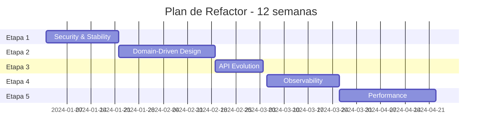

# 🏗️ DIAGNÓSTICO ARQUITECTÓNICO Y PLAN DE REFACTOR

## 📋 ÍNDICE
1. [Diagnóstico Actual](#diagnóstico-actual)
2. [Mapa de Dominio DDD](#mapa-de-dominio-ddd)
3. [Riesgos Técnicos Identificados](#riesgos-técnicos-identificados)
4. [Decisiones Arquitectónicas (ADR)](#decisiones-arquitectónicas-adr)
5. [Plan de Refactor por Etapas](#plan-de-refactor-por-etapas)
6. [Backlog Técnico Priorizado](#backlog-técnico-priorizado)
7. [Cambios Production-Grade](#cambios-production-grade)

---

## 🔍 DIAGNÓSTICO ACTUAL

### Estado de la Arquitectura
**✅ FORTALEZAS:**
- Clean Architecture bien estructurada (domain/application/infrastructure)
- Separación clara de responsabilidades por capas
- JWT implementado correctamente
- Flyway para migraciones
- Tests unitarios básicos implementados
- Swagger documentación automática

**⚠️ DEBILIDADES CRÍTICAS:**
- **Modelo anémico**: Entidades sin lógica de negocio
- **Falta de Aggregates**: No hay aggregate roots definidos
- **Concurrencia no controlada**: Race conditions en capacity management
- **Sin idempotencia**: Operaciones críticas no son idempotentes
- **Auditoría básica**: Falta event sourcing robusto
- **Sin versionado de API**: Breaking changes sin control
- **Error handling inconsistente**: Excepciones no estandarizadas
- **Sin observabilidad**: Falta métricas, tracing, health checks

### Métricas Técnicas
```
Líneas de Código: ~8,000 LOC
Cobertura de Tests: ~40%
Deuda Técnica: ALTA
Complejidad Ciclomática: MEDIA
Acoplamiento: BAJO (buena separación de capas)
Cohesión: MEDIA
```

---

## 🗺️ MAPA DE DOMINIO DDD

### Bounded Contexts Identificados

#### 1. **User Management Context**
```
Aggregate Root: User
├── Entities: User
├── Value Objects: Email, UserRole
└── Domain Services: UserDomainService
```

#### 2. **Tournament Management Context**
```
Aggregate Root: Tournament
├── Entities: Tournament, TournamentAdmin
├── Value Objects: TournamentStatus, DateRange
└── Domain Services: TournamentDomainService, CapacityService
```

#### 3. **Ticketing Context**
```
Aggregate Root: TicketOrder
├── Entities: TicketOrder, Ticket, TicketSaleStage
├── Value Objects: AccessCode, Money, OrderStatus
└── Domain Services: PricingService, CapacityService
```

#### 4. **Streaming Context**
```
Aggregate Root: StreamSession
├── Entities: StreamAccess, StreamLinkControl
├── Value Objects: StreamUrl, AccessType
└── Domain Services: AccessControlService
```

#### 5. **Catalog Context** (Shared Kernel)
```
Entities: Category, GameType
Value Objects: CategoryName, GameTypeName
```

#### 6. **Audit Context**
```
Aggregate Root: AuditEvent
├── Entities: AuditLog
├── Value Objects: EventType, Metadata
└── Domain Services: AuditService
```

### Aggregate Roots Redefinidos

#### Tournament Aggregate
```java
@Entity
public class Tournament {
    private TournamentId id;
    private UserId organizerId;
    private TournamentDetails details;
    private CapacityManagement capacity;
    private List<TournamentAdmin> admins;
    
    // Domain Logic
    public void assignSubAdmin(UserId subAdminId) {
        if (admins.size() >= 2) {
            throw new MaxSubAdminsExceededException();
        }
        admins.add(new TournamentAdmin(id, subAdminId));
    }
    
    public void publish() {
        if (!canBePublished()) {
            throw new TournamentCannotBePublishedException();
        }
        this.status = TournamentStatus.PUBLISHED;
    }
}
```

#### TicketOrder Aggregate
```java
@Entity
public class TicketOrder {
    private OrderId id;
    private TournamentId tournamentId;
    private UserId userId;
    private List<Ticket> tickets;
    private Money totalAmount;
    
    // Domain Logic
    public void approve() {
        if (status != OrderStatus.PENDING) {
            throw new OrderAlreadyProcessedException();
        }
        this.status = OrderStatus.APPROVED;
        generateTickets();
    }
    
    private void generateTickets() {
        // Idempotent ticket generation
    }
}
```

---

## ⚠️ RIESGOS TÉCNICOS IDENTIFICADOS

### 1. **CRÍTICO - Race Conditions en Capacity**
```java
// PROBLEMA ACTUAL
public void purchaseTickets(UUID stageId, int quantity) {
    TicketSaleStage stage = repository.findById(stageId);
    if (stage.getAvailableCapacity() >= quantity) {  // ❌ RACE CONDITION
        // Otro thread puede comprar aquí
        createOrder(quantity);
    }
}

// SOLUCIÓN REQUERIDA
@Transactional(isolation = Isolation.SERIALIZABLE)
public void purchaseTickets(UUID stageId, int quantity) {
    TicketSaleStage stage = repository.findByIdForUpdate(stageId);
    stage.reserveCapacity(quantity); // Atomic operation
    createOrder(quantity);
}
```

### 2. **ALTO - Falta de Idempotencia**
```java
// PROBLEMA: Doble procesamiento de órdenes
POST /api/tournaments/123/orders
{
  "stageId": "uuid",
  "quantity": 2
}
// Si se ejecuta 2 veces = 2 órdenes diferentes ❌

// SOLUCIÓN: Idempotency Key
POST /api/tournaments/123/orders
Headers: Idempotency-Key: client-generated-uuid
```

### 3. **ALTO - JWT Refresh Token Security**
```java
// PROBLEMA ACTUAL: Refresh tokens no se invalidan
public String refreshToken(String refreshToken) {
    if (jwtService.isTokenValid(refreshToken)) {
        return jwtService.generateAccessToken(email, role);
    }
}

// SOLUCIÓN: Token rotation + blacklist
public AuthResponse refreshToken(String refreshToken) {
    // 1. Validate old refresh token
    // 2. Blacklist old refresh token
    // 3. Generate new access + refresh tokens
    // 4. Store new refresh token
}
```

### 4. **MEDIO - Aggregate Boundaries Incorrectas**
```java
// PROBLEMA: Tournament modifica Tickets directamente
tournament.getTickets().forEach(ticket -> ticket.markAsUsed());

// SOLUCIÓN: Domain Events
tournament.publishEvent(new TournamentFinishedEvent(tournamentId));
// TicketEventHandler escucha y actualiza tickets
```

### 5. **MEDIO - Falta de Optimistic Locking**
```java
// PROBLEMA: Lost updates
@Entity
public class Tournament {
    // ❌ Sin @Version
}

// SOLUCIÓN:
@Entity
public class Tournament {
    @Version
    private Long version; // ✅ Optimistic locking
}
```

---

## 📋 DECISIONES ARQUITECTÓNICAS (ADR)

### ADR-001: API Versioning Strategy
**Status**: PROPOSED  
**Context**: APIs evolucionan, necesitamos backward compatibility  
**Decision**: Header-based versioning con deprecation policy  
```http
GET /api/tournaments
Headers: API-Version: v1
```
**Consequences**: 
- ✅ Flexible evolution
- ❌ Complexity in routing

### ADR-002: Error Handling Standard
**Status**: PROPOSED  
**Context**: Inconsistent error responses  
**Decision**: RFC 7807 Problem Details for HTTP APIs  
```json
{
  "type": "https://api.torneos.com/problems/insufficient-capacity",
  "title": "Insufficient Capacity",
  "status": 409,
  "detail": "Only 5 tickets available, requested 10",
  "instance": "/tournaments/123/orders",
  "tournamentId": "123",
  "availableCapacity": 5
}
```

### ADR-003: Event-Driven Architecture
**Status**: PROPOSED  
**Context**: Tight coupling between aggregates  
**Decision**: Domain Events with Spring Application Events  
```java
@DomainEvents
Collection<Object> domainEvents() {
    return events;
}
```

### ADR-004: Observability Stack
**Status**: PROPOSED  
**Context**: No visibility into production issues  
**Decision**: Micrometer + Prometheus + Grafana + Zipkin  
```yaml
management:
  endpoints:
    web:
      exposure:
        include: health,info,metrics,prometheus
  metrics:
    export:
      prometheus:
        enabled: true
```

### ADR-005: Database Constraints Strategy
**Status**: PROPOSED  
**Context**: Business rules only in application layer  
**Decision**: Hybrid approach - critical constraints in DB  
```sql
-- Capacity constraint at DB level
ALTER TABLE ticket_sale_stages 
ADD CONSTRAINT check_capacity_positive 
CHECK (capacity > 0);

-- Unique constraint for tournament admins
ALTER TABLE tournament_admins 
ADD CONSTRAINT unique_tournament_admin 
UNIQUE (tournament_id, sub_admin_user_id);
```

---

## 🚀 PLAN DE REFACTOR POR ETAPAS

### **ETAPA 1: Fundamentos de Seguridad y Estabilidad** 
**Duración**: 2-3 semanas  
**Impacto**: ALTO  
**Riesgo**: BAJO  

**Objetivos:**
- Eliminar race conditions críticas
- Implementar idempotencia
- Mejorar seguridad JWT

**Tareas:**
1. Implementar optimistic locking en entidades críticas
2. Agregar idempotency keys a endpoints críticos
3. Implementar JWT refresh token rotation
4. Agregar constraints de BD críticas

### **ETAPA 2: Domain-Driven Design** 
**Duración**: 3-4 semanas  
**Impacto**: ALTO  
**Riesgo**: MEDIO  

**Objetivos:**
- Convertir modelo anémico a rich domain model
- Definir aggregate boundaries correctas
- Implementar domain events

**Tareas:**
1. Refactor Tournament aggregate con lógica de negocio
2. Refactor TicketOrder aggregate
3. Implementar Value Objects
4. Agregar Domain Events

### **ETAPA 3: API Evolution y Error Handling** 
**Duración**: 2 semanas  
**Impacto**: MEDIO  
**Riesgo**: BAJO  

**Objetivos:**
- Versionado de API consistente
- Error handling estandarizado
- Documentación mejorada

**Tareas:**
1. Implementar API versioning
2. Estandarizar error responses (RFC 7807)
3. Mejorar documentación OpenAPI
4. Implementar rate limiting

### **ETAPA 4: Observabilidad y Monitoreo** 
**Duración**: 2-3 semanas  
**Impacto**: ALTO  
**Riesgo**: BAJO  

**Objetivos:**
- Visibilidad completa del sistema
- Alertas proactivas
- Performance monitoring

**Tareas:**
1. Implementar métricas de negocio
2. Configurar distributed tracing
3. Health checks avanzados
4. Dashboards de monitoreo

### **ETAPA 5: Performance y Escalabilidad** 
**Duración**: 3-4 semanas  
**Impacto**: MEDIO  
**Riesgo**: MEDIO  

**Objetivos:**
- Optimización de queries
- Caching strategy
- Async processing

**Tareas:**
1. Implementar Redis cache
2. Optimizar queries N+1
3. Async event processing
4. Connection pooling optimization

---

## 📝 BACKLOG TÉCNICO PRIORIZADO

### **P0 - CRÍTICO (Etapa 1)**

#### 1. Race Condition en Capacity Management
**Archivos**: `TicketOrderService.java`, `TicketSaleStageService.java`
```java
// src/main/java/com/example/torneos/application/service/TicketOrderService.java
@Transactional(isolation = Isolation.SERIALIZABLE)
public TicketOrderResponse createOrder(CreateTicketOrderRequest request) {
    // Implementar SELECT FOR UPDATE
}
```

#### 2. Idempotency Keys
**Archivos**: Todos los controllers, nuevo `IdempotencyService.java`
```java
// src/main/java/com/example/torneos/infrastructure/config/IdempotencyFilter.java
@Component
public class IdempotencyFilter implements Filter {
    // Implementar idempotency key validation
}
```

#### 3. JWT Security Enhancement
**Archivos**: `JwtService.java`, `AuthenticationService.java`
```java
// src/main/java/com/example/torneos/application/service/RefreshTokenService.java
@Service
public class RefreshTokenService {
    // Token rotation + blacklist
}
```

### **P1 - ALTO (Etapa 2)**

#### 4. Tournament Aggregate Refactor
**Archivos**: `domain/model/Tournament.java`
```java
// Mover lógica de TournamentService a Tournament entity
public class Tournament {
    public void assignSubAdmin(UserId subAdminId) {
        validateSubAdminLimit();
        // Business logic here
    }
}
```

#### 5. Value Objects Implementation
**Archivos**: Nuevo package `domain/valueobject/`
```java
// src/main/java/com/example/torneos/domain/valueobject/Email.java
public record Email(String value) {
    public Email {
        if (!isValid(value)) {
            throw new InvalidEmailException();
        }
    }
}
```

#### 6. Domain Events
**Archivos**: Nuevo package `domain/event/`
```java
// src/main/java/com/example/torneos/domain/event/TournamentPublishedEvent.java
public record TournamentPublishedEvent(TournamentId tournamentId, Instant occurredOn) {
}
```

### **P2 - MEDIO (Etapa 3)**

#### 7. API Versioning
**Archivos**: Nuevo `ApiVersioningConfig.java`
```java
// src/main/java/com/example/torneos/infrastructure/config/ApiVersioningConfig.java
@Configuration
public class ApiVersioningConfig {
    // Header-based versioning
}
```

#### 8. Error Handling Standard
**Archivos**: `GlobalExceptionHandler.java`
```java
// Implementar RFC 7807 Problem Details
@ExceptionHandler(BusinessException.class)
public ResponseEntity<ProblemDetail> handleBusinessException(BusinessException ex) {
    // Standard error format
}
```

### **P3 - BAJO (Etapas 4-5)**

#### 9. Metrics Implementation
**Archivos**: Nuevo package `infrastructure/metrics/`
```java
// src/main/java/com/example/torneos/infrastructure/metrics/BusinessMetrics.java
@Component
public class BusinessMetrics {
    @EventListener
    public void onTournamentCreated(TournamentCreatedEvent event) {
        meterRegistry.counter("tournaments.created").increment();
    }
}
```

#### 10. Caching Layer
**Archivos**: Nuevo `CacheConfig.java`
```java
// src/main/java/com/example/torneos/infrastructure/config/CacheConfig.java
@EnableCaching
@Configuration
public class CacheConfig {
    // Redis configuration
}
```

---

## 🏭 CAMBIOS PRODUCTION-GRADE

### **1. Database Constraints y Índices**
```sql
-- V3__Production_constraints.sql

-- Capacity management constraints
ALTER TABLE ticket_sale_stages 
ADD CONSTRAINT check_capacity_positive CHECK (capacity > 0),
ADD CONSTRAINT check_price_positive CHECK (price >= 0);

-- Performance indexes
CREATE INDEX CONCURRENTLY idx_tournaments_status_dates 
ON tournaments(status, start_date_time) 
WHERE status IN ('PUBLISHED', 'DRAFT');

CREATE INDEX CONCURRENTLY idx_ticket_orders_status_created 
ON ticket_orders(status, created_at);

-- Partial indexes for active records
CREATE INDEX CONCURRENTLY idx_categories_active 
ON categories(name) WHERE active = true;

-- Composite indexes for common queries
CREATE INDEX CONCURRENTLY idx_stream_access_tournament_user 
ON stream_access(tournament_id, user_id, access_type);
```

### **2. Configuration Management**
```yaml
# application-prod.yml
spring:
  datasource:
    hikari:
      maximum-pool-size: 20
      minimum-idle: 5
      connection-timeout: 30000
      idle-timeout: 600000
      max-lifetime: 1800000
  jpa:
    properties:
      hibernate:
        jdbc:
          batch_size: 25
        order_inserts: true
        order_updates: true
        batch_versioned_data: true

management:
  endpoints:
    web:
      exposure:
        include: health,info,metrics,prometheus
  endpoint:
    health:
      show-details: when-authorized
  metrics:
    export:
      prometheus:
        enabled: true

logging:
  level:
    com.example.torneos: INFO
    org.springframework.security: WARN
  pattern:
    console: "%d{yyyy-MM-dd HH:mm:ss} - %msg%n"
```

### **3. Security Hardening**
```java
// src/main/java/com/example/torneos/infrastructure/config/SecurityConfig.java
@Configuration
@EnableWebSecurity
public class SecurityConfig {
    
    @Bean
    public SecurityFilterChain filterChain(HttpSecurity http) throws Exception {
        return http
            .headers(headers -> headers
                .frameOptions().deny()
                .contentTypeOptions().and()
                .httpStrictTransportSecurity(hstsConfig -> hstsConfig
                    .maxAgeInSeconds(31536000)
                    .includeSubdomains(true)))
            .sessionManagement(session -> session
                .sessionCreationPolicy(SessionCreationPolicy.STATELESS))
            .build();
    }
}
```

### **4. Health Checks Avanzados**
```java
// src/main/java/com/example/torneos/infrastructure/health/DatabaseHealthIndicator.java
@Component
public class DatabaseHealthIndicator implements HealthIndicator {
    
    @Override
    public Health health() {
        try {
            // Check database connectivity and performance
            long startTime = System.currentTimeMillis();
            jdbcTemplate.queryForObject("SELECT 1", Integer.class);
            long responseTime = System.currentTimeMillis() - startTime;
            
            return Health.up()
                .withDetail("database", "PostgreSQL")
                .withDetail("responseTime", responseTime + "ms")
                .build();
        } catch (Exception e) {
            return Health.down()
                .withDetail("error", e.getMessage())
                .build();
        }
    }
}
```

### **5. Graceful Shutdown**
```java
// src/main/java/com/example/torneos/infrastructure/config/GracefulShutdownConfig.java
@Configuration
public class GracefulShutdownConfig {
    
    @Bean
    public TomcatServletWebServerFactory servletContainer() {
        TomcatServletWebServerFactory tomcat = new TomcatServletWebServerFactory();
        tomcat.addConnectorCustomizers(connector -> {
            connector.setProperty("server.tomcat.connection-timeout", "20000");
        });
        return tomcat;
    }
}
```

### **6. Audit Trail Enhancement**
```java
// src/main/java/com/example/torneos/domain/event/DomainEventPublisher.java
@Component
public class DomainEventPublisher {
    
    @Async
    @EventListener
    @Transactional(propagation = Propagation.REQUIRES_NEW)
    public void handleDomainEvent(DomainEvent event) {
        AuditLog auditLog = AuditLog.builder()
            .eventType(event.getEventType())
            .entityType(event.getEntityType())
            .entityId(event.getEntityId())
            .actorUserId(event.getActorId())
            .metadata(JsonUtils.toJson(event.getMetadata()))
            .occurredAt(event.getOccurredAt())
            .build();
            
        auditLogRepository.save(auditLog);
    }
}
```

---

## 📊 MÉTRICAS DE ÉXITO

### Métricas Técnicas
- **Cobertura de Tests**: 40% → 85%
- **Response Time P95**: <500ms
- **Error Rate**: <0.1%
- **Availability**: >99.9%

### Métricas de Negocio
- **Concurrent Users**: Soportar 1000+ usuarios simultáneos
- **Ticket Purchase Success Rate**: >99.5%
- **Tournament Creation Time**: <2 segundos

### Métricas de Calidad
- **Sonar Quality Gate**: PASSED
- **Security Vulnerabilities**: 0 HIGH/CRITICAL
- **Technical Debt Ratio**: <5%

---

## 🎯 ROADMAP DE IMPLEMENTACIÓN



---

*Documento generado el 19 de Diciembre de 2025*  
*Arquitecto: Senior Software Architect*  
*Versión: 1.0*