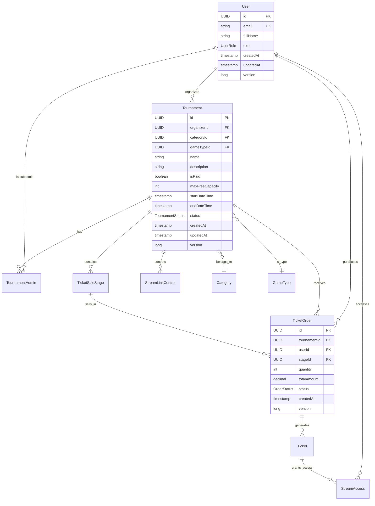
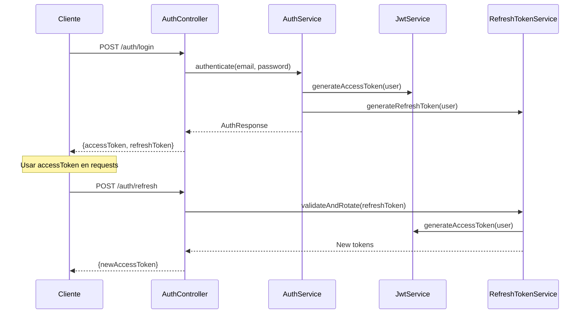
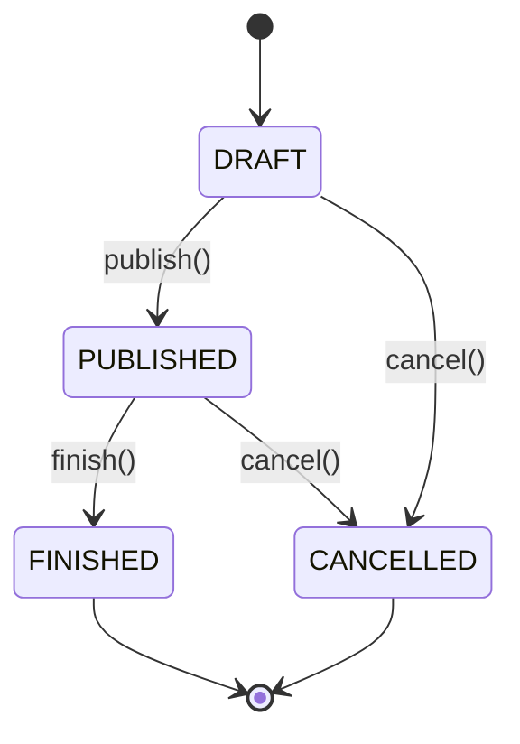
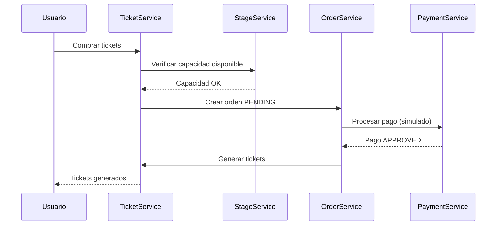

# 🏆 PLATAFORMA DE TORNEOS VIRTUALES - DOCUMENTACIÓN COMPLETA

## 📋 ÍNDICE
1. [Descripción General](#-descripción-general)
2. [Arquitectura del Sistema](#-arquitectura-del-sistema)
3. [Tecnologías y Dependencias](#-tecnologías-y-dependencias)
4. [Modelo de Datos](#-modelo-de-datos)
5. [APIs y Endpoints](#-apis-y-endpoints)
6. [Seguridad y Autenticación](#-seguridad-y-autenticación)
7. [Reglas de Negocio](#-reglas-de-negocio)
8. [Configuración y Despliegue](#-configuración-y-despliegue)
9. [Testing](#-testing)
10. [Mejoras Implementadas](#-mejoras-implementadas)
11. [Guía de Desarrollo](#-guía-de-desarrollo)

---

## 🎯 DESCRIPCIÓN GENERAL

### Objetivo del Proyecto
Backend completo para una **plataforma de torneos virtuales** desarrollado con **Spring Boot 3.2.0** siguiendo **arquitectura hexagonal/clean**. El sistema permite la gestión integral de torneos de e-sports, venta de tickets por etapas, control de acceso a streams y administración de usuarios con diferentes roles.

### Funcionalidades Principales
- **👥 Gestión de Usuarios**: Registro, autenticación JWT, roles jerárquicos
- **🏆 Gestión de Torneos**: CRUD completo con reglas de negocio específicas
- **🎫 Sistema de Tickets**: Venta por etapas con precios dinámicos
- **📺 Control de Streams**: Acceso gratuito limitado y acceso pagado
- **📊 Auditoría Completa**: Trazabilidad de todas las operaciones críticas
- **⚡ Performance**: Cache, procesamiento asíncrono, optimizaciones
- **🔒 Seguridad**: JWT con refresh tokens, idempotencia, rate limiting

### Características Técnicas
- **Arquitectura**: Clean Architecture / Hexagonal
- **Patrón**: Domain-Driven Design (DDD)
- **Base de Datos**: H2 (desarrollo) / PostgreSQL (producción)
- **Seguridad**: JWT stateless con refresh token rotation
- **Documentación**: OpenAPI 3.0 / Swagger UI
- **Observabilidad**: Métricas, logging estructurado, health checks

---

## 🏗️ ARQUITECTURA DEL SISTEMA

### Clean Architecture Implementada

```
src/main/java/com/example/torneos/
├── 🎯 domain/                    # CAPA DE DOMINIO (Entidades puras)
│   ├── model/                   # Entidades de dominio
│   ├── repository/              # Interfaces de repositorio (puertos)
│   └── event/                   # Eventos de dominio
├── 🔧 application/              # CAPA DE APLICACIÓN (Casos de uso)
│   ├── dto/
│   │   ├── request/            # DTOs de entrada
│   │   └── response/           # DTOs de salida
│   └── service/                # Servicios de aplicación
└── 🌐 infrastructure/          # CAPA DE INFRAESTRUCTURA (Adaptadores)
    ├── controller/             # Controllers REST
    ├── persistence/            # Persistencia JPA
    │   ├── entity/            # Entidades JPA
    │   ├── repository/        # Implementaciones de repositorio
    │   └── mapper/            # Mappers domain <-> JPA
    ├── config/                # Configuraciones
    ├── async/                 # Procesamiento asíncrono
    ├── cache/                 # Sistema de cache
    ├── metrics/               # Métricas de negocio
    └── validation/            # Validaciones personalizadas
```

### Principios Arquitectónicos Aplicados

#### 1. **Inversión de Dependencias**
```java
// Domain no depende de Infrastructure
public interface TournamentRepository {  // Puerto en domain
    Tournament save(Tournament tournament);
}

@Repository
public class TournamentRepositoryImpl implements TournamentRepository {  // Adaptador en infrastructure
    // Implementación JPA
}
```

#### 2. **Separación de Responsabilidades**
- **Domain**: Lógica de negocio pura
- **Application**: Orquestación de casos de uso
- **Infrastructure**: Detalles técnicos (BD, REST, etc.)

#### 3. **Domain-Driven Design**
```java
// Aggregate Root con lógica de negocio
public class Tournament {
    public void assignSubAdmin(UUID subAdminId) {
        if (subAdmins.size() >= MAX_SUBADMINS) {
            throw new MaxSubAdminsExceededException();
        }
        // Lógica de dominio
    }
}
```

---

## 🛠️ TECNOLOGÍAS Y DEPENDENCIAS

### Stack Tecnológico Principal

#### Backend Framework
```xml
<dependency>
    <groupId>org.springframework.boot</groupId>
    <artifactId>spring-boot-starter-parent</artifactId>
    <version>3.2.0</version>
</dependency>
```

#### Dependencias Clave
```xml
<!-- Web y REST APIs -->
<dependency>
    <groupId>org.springframework.boot</groupId>
    <artifactId>spring-boot-starter-web</artifactId>
</dependency>

<!-- Persistencia -->
<dependency>
    <groupId>org.springframework.boot</groupId>
    <artifactId>spring-boot-starter-data-jpa</artifactId>
</dependency>

<!-- Seguridad -->
<dependency>
    <groupId>org.springframework.boot</groupId>
    <artifactId>spring-boot-starter-security</artifactId>
</dependency>

<!-- JWT -->
<dependency>
    <groupId>io.jsonwebtoken</groupId>
    <artifactId>jjwt-api</artifactId>
    <version>0.12.3</version>
</dependency>

<!-- Documentación -->
<dependency>
    <groupId>org.springdoc</groupId>
    <artifactId>springdoc-openapi-starter-webmvc-ui</artifactId>
    <version>2.2.0</version>
</dependency>

<!-- Migraciones -->
<dependency>
    <groupId>org.flywaydb</groupId>
    <artifactId>flyway-core</artifactId>
</dependency>

<!-- Monitoreo -->
<dependency>
    <groupId>org.springframework.boot</groupId>
    <artifactId>spring-boot-starter-actuator</artifactId>
</dependency>
```

### Base de Datos
- **Desarrollo**: H2 Database (en memoria)
- **Producción**: PostgreSQL
- **Migraciones**: Flyway

### Herramientas de Desarrollo
- **Java**: 17+
- **Maven**: Gestión de dependencias
- **Swagger UI**: Documentación interactiva
- **H2 Console**: Interfaz de BD en desarrollo

---

## 🗄️ MODELO DE DATOS

### Diagrama de Entidades Principales



### Entidades del Dominio Detalladas

#### 1. **User** - Gestión de Usuarios
```java
public class User {
    private UUID id;
    private String email;           // UNIQUE
    private String fullName;
    private UserRole role;          // USER, ORGANIZER, SUBADMIN
    private LocalDateTime createdAt;
    private LocalDateTime updatedAt;
    private Long version;           // Optimistic locking
}
```

**Roles del Sistema:**
- **USER**: Usuario básico que puede comprar tickets
- **ORGANIZER**: Puede crear y gestionar torneos
- **SUBADMIN**: Puede administrar torneos específicos asignados

#### 2. **Tournament** - Gestión de Torneos
```java
public class Tournament {
    private UUID id;
    private UUID organizerId;       // FK -> User
    private UUID categoryId;        // FK -> Category
    private UUID gameTypeId;        // FK -> GameType
    private String name;
    private String description;
    private Boolean isPaid;         // true = torneo pagado, false = gratuito
    private Integer maxFreeCapacity; // Solo para torneos gratuitos
    private LocalDateTime startDateTime;
    private LocalDateTime endDateTime;
    private TournamentStatus status; // DRAFT, PUBLISHED, FINISHED, CANCELLED
    private LocalDateTime createdAt;
    private LocalDateTime updatedAt;
    private Long version;
}
```

**Estados del Torneo:**
- **DRAFT**: Borrador, en construcción
- **PUBLISHED**: Publicado y visible para usuarios
- **FINISHED**: Torneo finalizado
- **CANCELLED**: Torneo cancelado

#### 3. **TicketSaleStage** - Etapas de Venta
```java
public class TicketSaleStage {
    private UUID id;
    private UUID tournamentId;      // FK -> Tournament
    private StageType stageType;    // EARLY_BIRD, REGULAR, LAST_MINUTE
    private BigDecimal price;       // Precio por ticket
    private Integer capacity;       // Capacidad máxima de la etapa
    private LocalDateTime startDateTime;
    private LocalDateTime endDateTime;
    private Boolean active;
}
```

**Tipos de Etapa:**
- **EARLY_BIRD**: Venta anticipada (precio reducido)
- **REGULAR**: Venta regular (precio normal)
- **LAST_MINUTE**: Última oportunidad (precio premium)

#### 4. **TicketOrder** - Órdenes de Compra
```java
public class TicketOrder {
    private UUID id;
    private UUID tournamentId;      // FK -> Tournament
    private UUID userId;            // FK -> User
    private UUID stageId;           // FK -> TicketSaleStage
    private Integer quantity;       // Cantidad de tickets
    private BigDecimal totalAmount; // Monto total
    private OrderStatus status;     // PENDING, APPROVED, REJECTED
    private LocalDateTime createdAt;
    private Long version;
}
```

#### 5. **Ticket** - Tickets Individuales
```java
public class Ticket {
    private UUID id;
    private UUID orderId;           // FK -> TicketOrder
    private UUID tournamentId;      // FK -> Tournament
    private UUID userId;            // FK -> User
    private String accessCode;      // Código único de acceso
    private TicketStatus status;    // ISSUED, USED, CANCELLED
    private LocalDateTime usedAt;
    private LocalDateTime createdAt;
}
```

#### 6. **StreamAccess** - Control de Acceso a Streams
```java
public class StreamAccess {
    private UUID id;
    private UUID tournamentId;      // FK -> Tournament
    private UUID userId;            // FK -> User
    private AccessType accessType;  // FREE, PAID
    private UUID ticketId;          // FK -> Ticket (opcional, solo para PAID)
    private LocalDateTime createdAt;
}
```

#### 7. **AuditLog** - Auditoría del Sistema
```java
public class AuditLog {
    private UUID id;
    private String eventType;       // TOURNAMENT_CREATED, TICKET_PURCHASED, etc.
    private String entityType;      // Tournament, TicketOrder, etc.
    private UUID entityId;          // ID de la entidad afectada
    private UUID actorUserId;       // Usuario que realizó la acción
    private String metadata;        // JSON con información adicional
    private LocalDateTime createdAt;
}
```

### Tablas de Soporte

#### Category y GameType
```java
public class Category {
    private UUID id;
    private String name;            // UNIQUE
    private Boolean active;
}

public class GameType {
    private UUID id;
    private String name;            // UNIQUE
    private Boolean active;
}
```

---

## 🚀 APIS Y ENDPOINTS

### Estructura de URLs
**Base URL**: `http://localhost:8081/api`

### 1. **Authentication Controller** - `/api/auth`

#### POST /api/auth/login
**Descripción**: Autenticación de usuario  
**Acceso**: Público  
```json
Request:
{
  "email": "user@example.com",
  "password": "password123"
}

Response:
{
  "accessToken": "eyJhbGciOiJIUzI1NiIsInR5cCI6IkpXVCJ9...",
  "refreshToken": "eyJhbGciOiJIUzI1NiIsInR5cCI6IkpXVCJ9...",
  "tokenType": "Bearer",
  "expiresIn": 3600,
  "user": {
    "id": "uuid",
    "email": "user@example.com",
    "fullName": "John Doe",
    "role": "USER"
  }
}
```

#### POST /api/auth/refresh
**Descripción**: Renovar access token  
**Acceso**: Público  
```json
Request:
{
  "refreshToken": "eyJhbGciOiJIUzI1NiIsInR5cCI6IkpXVCJ9..."
}

Response:
{
  "accessToken": "eyJhbGciOiJIUzI1NiIsInR5cCI6IkpXVCJ9...",
  "tokenType": "Bearer",
  "expiresIn": 3600
}
```

### 2. **User Controller** - `/api/users`

#### POST /api/users
**Descripción**: Crear usuario  
**Acceso**: Público  
```json
Request:
{
  "email": "user@example.com",
  "fullName": "John Doe",
  "role": "USER"
}

Response:
{
  "id": "uuid",
  "email": "user@example.com",
  "fullName": "John Doe",
  "role": "USER",
  "createdAt": "2023-12-19T10:00:00",
  "updatedAt": "2023-12-19T10:00:00"
}
```

#### GET /api/users
**Descripción**: Listar usuarios con paginación  
**Acceso**: ORGANIZER, SUBADMIN  
**Parámetros**: `page`, `size`, `role`  

#### GET /api/users/{id}
**Descripción**: Obtener usuario por ID  
**Acceso**: USER (propio), ORGANIZER, SUBADMIN  

### 3. **Tournament Controller** - `/api/tournaments`

#### POST /api/tournaments
**Descripción**: Crear torneo  
**Acceso**: ORGANIZER  
```json
Request:
{
  "categoryId": "uuid",
  "gameTypeId": "uuid",
  "name": "Torneo de Ejemplo",
  "description": "Descripción del torneo",
  "isPaid": true,
  "maxFreeCapacity": 100,
  "startDateTime": "2024-01-15T10:00:00",
  "endDateTime": "2024-01-15T18:00:00"
}

Response:
{
  "id": "uuid",
  "organizerId": "uuid",
  "categoryId": "uuid",
  "gameTypeId": "uuid",
  "name": "Torneo de Ejemplo",
  "description": "Descripción del torneo",
  "isPaid": true,
  "maxFreeCapacity": 100,
  "startDateTime": "2024-01-15T10:00:00",
  "endDateTime": "2024-01-15T18:00:00",
  "status": "DRAFT",
  "createdAt": "2023-12-19T10:00:00",
  "updatedAt": "2023-12-19T10:00:00"
}
```

#### GET /api/tournaments
**Descripción**: Listar torneos con filtros  
**Acceso**: Público  
**Parámetros**:
- `isPaid`: Boolean
- `status`: TournamentStatus
- `categoryId`: UUID
- `gameTypeId`: UUID
- `organizerId`: UUID
- `page`: Integer (default: 0)
- `size`: Integer (default: 20)

#### POST /api/tournaments/{id}/publish
**Descripción**: Publicar torneo  
**Acceso**: ORGANIZER (owner), SUBADMIN (assigned)  

#### POST /api/tournaments/{id}/subadmins
**Descripción**: Asignar subadministrador  
**Acceso**: ORGANIZER (owner)  
```json
Request:
{
  "subAdminUserId": "uuid"
}
```

### 4. **Ticket Sale Stage Controller** - `/api/tournaments/{tournamentId}/stages`

#### POST /api/tournaments/{tournamentId}/stages
**Descripción**: Crear etapa de venta  
**Acceso**: ORGANIZER (owner), SUBADMIN (assigned)  
```json
Request:
{
  "stageType": "EARLY_BIRD",
  "price": 25.00,
  "capacity": 50,
  "startDateTime": "2024-01-01T00:00:00",
  "endDateTime": "2024-01-07T23:59:59"
}
```

### 5. **Ticket Controller** - `/api/tickets`

#### POST /api/tournaments/{tournamentId}/orders
**Descripción**: Crear orden de tickets (comprar)  
**Acceso**: USER, ORGANIZER, SUBADMIN  
```json
Request:
{
  "stageId": "uuid",
  "quantity": 2
}

Response:
{
  "id": "uuid",
  "tournamentId": "uuid",
  "userId": "uuid",
  "stageId": "uuid",
  "quantity": 2,
  "totalAmount": 50.00,
  "status": "PENDING",
  "createdAt": "2023-12-19T10:00:00"
}
```

#### POST /api/tickets/{accessCode}/validate
**Descripción**: Validar ticket (marcar como usado)  
**Acceso**: ORGANIZER (owner), SUBADMIN (assigned)  

### 6. **Stream Access Controller** - `/api/streams`

#### POST /api/tournaments/{tournamentId}/access
**Descripción**: Solicitar acceso al stream  
**Acceso**: USER, ORGANIZER, SUBADMIN  
```json
Request (Acceso Gratuito):
{
  "accessType": "FREE"
}

Request (Acceso Pagado):
{
  "accessType": "PAID",
  "ticketId": "uuid"
}
```

### 7. **Audit Log Controller** - `/api/audit`

#### GET /api/audit/logs
**Descripción**: Consultar logs de auditoría  
**Acceso**: ORGANIZER, SUBADMIN  
**Parámetros**: `entityType`, `entityId`, `actorUserId`, `eventType`  

---

## 🔐 SEGURIDAD Y AUTENTICACIÓN

### Arquitectura de Seguridad JWT

#### 1. **Flujo de Autenticación**


#### 2. **Configuración de Seguridad**
```java
@Configuration
@EnableWebSecurity
public class SecurityConfig {
    
    @Bean
    public SecurityFilterChain filterChain(HttpSecurity http) throws Exception {
        return http
            .csrf(csrf -> csrf.disable())
            .sessionManagement(session -> 
                session.sessionCreationPolicy(SessionCreationPolicy.STATELESS))
            .authorizeHttpRequests(auth -> auth
                .requestMatchers("/api/auth/**").permitAll()
                .requestMatchers("/swagger-ui/**", "/v3/api-docs/**").permitAll()
                .requestMatchers(HttpMethod.GET, "/api/tournaments/**").permitAll()
                .requestMatchers(HttpMethod.POST, "/api/users").permitAll()
                .anyRequest().authenticated())
            .addFilterBefore(jwtAuthenticationFilter, 
                UsernamePasswordAuthenticationFilter.class)
            .build();
    }
}
```

#### 3. **JWT Service Implementation**
```java
@Service
public class JwtService {
    
    private final String SECRET_KEY = "mySecretKey";
    private final long ACCESS_TOKEN_EXPIRATION = 3600000;  // 1 hora
    private final long REFRESH_TOKEN_EXPIRATION = 86400000; // 24 horas
    
    public String generateAccessToken(String email, UserRole role) {
        return Jwts.builder()
            .setSubject(email)
            .claim("role", role.name())
            .setIssuedAt(new Date())
            .setExpiration(new Date(System.currentTimeMillis() + ACCESS_TOKEN_EXPIRATION))
            .signWith(getSignInKey(), SignatureAlgorithm.HS256)
            .compact();
    }
    
    public boolean isTokenValid(String token) {
        try {
            Jwts.parserBuilder()
                .setSigningKey(getSignInKey())
                .build()
                .parseClaimsJws(token);
            return true;
        } catch (JwtException | IllegalArgumentException e) {
            return false;
        }
    }
}
```

### Características de Seguridad Implementadas

#### 1. **Refresh Token Rotation**
- Los refresh tokens se invalidan después del uso
- Nuevos tokens se generan en cada refresh
- Previene ataques de replay

#### 2. **Idempotencia**
```java
@Component
public class IdempotencyFilter implements Filter {
    
    @Override
    public void doFilter(ServletRequest request, ServletResponse response, 
                        FilterChain chain) throws IOException, ServletException {
        
        HttpServletRequest httpRequest = (HttpServletRequest) request;
        String idempotencyKey = httpRequest.getHeader("Idempotency-Key");
        
        if (isIdempotentMethod(httpRequest.getMethod()) && idempotencyKey != null) {
            // Verificar si ya se procesó esta key
            if (idempotencyService.isAlreadyProcessed(idempotencyKey)) {
                // Retornar respuesta cached
                return;
            }
        }
        
        chain.doFilter(request, response);
    }
}
```

#### 3. **Rate Limiting**
```java
@Component
public class RateLimitingInterceptor implements HandlerInterceptor {
    
    @Override
    public boolean preHandle(HttpServletRequest request, 
                           HttpServletResponse response, 
                           Object handler) throws Exception {
        
        String clientId = getClientId(request);
        if (!rateLimitService.isAllowed(clientId)) {
            response.setStatus(HttpStatus.TOO_MANY_REQUESTS.value());
            return false;
        }
        
        return true;
    }
}
```

---

## 📋 REGLAS DE NEGOCIO

### 1. **Gestión de Usuarios**

#### Reglas de Registro
- ✅ Email debe ser único en el sistema
- ✅ Roles válidos: USER, ORGANIZER, SUBADMIN
- ✅ Cualquiera puede crear cuenta de USER
- ✅ Solo administradores pueden crear ORGANIZER/SUBADMIN

#### Reglas de Autenticación
- ✅ Access token válido por 1 hora
- ✅ Refresh token válido por 24 horas
- ✅ Refresh token rotation obligatorio

### 2. **Gestión de Torneos**

#### Reglas de Creación
```java
public class TournamentBusinessRules {
    
    // Solo ORGANIZER puede crear torneos
    public void validateOrganizerRole(UserRole role) {
        if (role != UserRole.ORGANIZER) {
            throw new UnauthorizedTournamentCreationException();
        }
    }
    
    // Máximo 2 torneos gratuitos activos por organizador
    public void validateFreeTournamentLimit(UUID organizerId, boolean isPaid) {
        if (!isPaid) {
            long activeFree = tournamentRepository
                .countActiveFreeTournaments(organizerId);
            if (activeFree >= 2) {
                throw new MaxFreeTournamentsExceededException();
            }
        }
    }
    
    // Fechas válidas
    public void validateDates(LocalDateTime start, LocalDateTime end) {
        if (start.isAfter(end)) {
            throw new InvalidTournamentDatesException();
        }
    }
}
```

#### Estados y Transiciones


### 3. **Sistema de Subadministradores**

#### Reglas de Asignación
- ✅ Máximo 2 subadmins por torneo
- ✅ Solo el organizador puede asignar/remover
- ✅ Usuario debe existir y tener rol USER o SUBADMIN
- ✅ No se puede asignar el mismo usuario dos veces

```java
public void assignSubAdmin(UUID tournamentId, UUID subAdminId) {
    Tournament tournament = getTournament(tournamentId);
    
    // Validar límite
    if (tournament.getSubAdmins().size() >= 2) {
        throw new MaxSubAdminsExceededException();
    }
    
    // Validar duplicados
    if (tournament.hasSubAdmin(subAdminId)) {
        throw new SubAdminAlreadyAssignedException();
    }
    
    tournament.addSubAdmin(subAdminId);
}
```

### 4. **Sistema de Tickets**

#### Reglas de Venta por Etapas
```java
public class TicketSaleRules {
    
    // Solo torneos pagados pueden tener etapas
    public void validatePaidTournament(Tournament tournament) {
        if (!tournament.isPaid()) {
            throw new FreeTourn amentCannotHaveStagesException();
        }
    }
    
    // Etapas no pueden solaparse en fechas
    public void validateNonOverlappingDates(List<TicketSaleStage> stages, 
                                          TicketSaleStage newStage) {
        for (TicketSaleStage stage : stages) {
            if (datesOverlap(stage, newStage)) {
                throw new OverlappingStagesException();
            }
        }
    }
    
    // Capacidad y precios positivos
    public void validatePositiveValues(int capacity, BigDecimal price) {
        if (capacity <= 0 || price.compareTo(BigDecimal.ZERO) <= 0) {
            throw new InvalidStageValuesException();
        }
    }
}
```

#### Proceso de Compra


### 5. **Control de Acceso a Streams**

#### Reglas de Acceso Gratuito
- ✅ Máximo 1 acceso gratuito por usuario por torneo
- ✅ Solo hasta alcanzar `maxFreeCapacity` del torneo
- ✅ Solo para torneos en estado PUBLISHED

#### Reglas de Acceso Pagado
- ✅ Requiere ticket válido (ISSUED, no USED)
- ✅ Ticket debe pertenecer al torneo
- ✅ Ticket debe pertenecer al usuario solicitante

```java
public StreamAccessResponse requestAccess(UUID tournamentId, 
                                        StreamAccessRequest request) {
    Tournament tournament = getTournament(tournamentId);
    
    if (request.getAccessType() == AccessType.FREE) {
        validateFreeAccess(tournament, userId);
    } else {
        validatePaidAccess(tournament, request.getTicketId(), userId);
    }
    
    return grantAccess(tournament, userId, request);
}
```

---

## ⚙️ CONFIGURACIÓN Y DESPLIEGUE

### Perfiles de Configuración

#### application.yml (Base)
```yaml
server:
  port: 8081

spring:
  application:
    name: torneos-backend
  profiles:
    active: dev

springdoc:
  api-docs:
    path: /api-docs
  swagger-ui:
    path: /swagger-ui.html

management:
  endpoints:
    web:
      exposure:
        include: health,info,metrics,prometheus
  endpoint:
    health:
      show-details: when-authorized

logging:
  level:
    com.example.torneos: INFO
    org.springframework.web: DEBUG
```

#### application-dev.yml (Desarrollo)
```yaml
spring:
  config:
    activate:
      on-profile: dev
  
  datasource:
    url: jdbc:h2:mem:torneos_db;DB_CLOSE_DELAY=-1;DB_CLOSE_ON_EXIT=FALSE
    username: sa
    password: 
    driver-class-name: org.h2.Driver
  
  h2:
    console:
      enabled: true
      path: /h2-console
  
  jpa:
    hibernate:
      ddl-auto: validate
    show-sql: true
    properties:
      hibernate:
        dialect: org.hibernate.dialect.H2Dialect
        format_sql: true
  
  flyway:
    enabled: true
    locations: classpath:db/migration
    baseline-on-migrate: true
```

#### application-prod.yml (Producción)
```yaml
spring:
  config:
    activate:
      on-profile: prod
  
  datasource:
    url: jdbc:postgresql://localhost:5432/torneos_db
    username: ${DB_USERNAME:postgres}
    password: ${DB_PASSWORD:postgres}
    driver-class-name: org.postgresql.Driver
    hikari:
      maximum-pool-size: 20
      minimum-idle: 5
      connection-timeout: 30000
      idle-timeout: 600000
      max-lifetime: 1800000
  
  jpa:
    hibernate:
      ddl-auto: validate
    show-sql: false
    properties:
      hibernate:
        dialect: org.hibernate.dialect.PostgreSQLDialect
        jdbc:
          batch_size: 25
        order_inserts: true
        order_updates: true
  
  flyway:
    enabled: true
    locations: classpath:db/migration
    baseline-on-migrate: false
```

### Variables de Entorno
```bash
# Base de datos
DB_URL=jdbc:postgresql://localhost:5432/torneos_db
DB_USERNAME=postgres
DB_PASSWORD=password

# JWT
JWT_SECRET=your-secret-key-here
JWT_ACCESS_EXPIRATION=3600000
JWT_REFRESH_EXPIRATION=86400000

# Servidor
SERVER_PORT=8081
SPRING_PROFILES_ACTIVE=prod
```

### Docker Configuration

#### Dockerfile
```dockerfile
FROM openjdk:17-jdk-slim

WORKDIR /app

COPY target/torneos-0.0.1-SNAPSHOT.jar app.jar

EXPOSE 8081

ENTRYPOINT ["java", "-jar", "app.jar"]
```

#### docker-compose.yml
```yaml
version: '3.8'
services:
  postgres:
    image: postgres:15
    environment:
      POSTGRES_DB: torneos_db
      POSTGRES_USER: postgres
      POSTGRES_PASSWORD: password
    ports:
      - "5432:5432"
    volumes:
      - postgres_data:/var/lib/postgresql/data

  app:
    build: .
    ports:
      - "8081:8081"
    environment:
      DB_URL: jdbc:postgresql://postgres:5432/torneos_db
      DB_USERNAME: postgres
      DB_PASSWORD: password
      SPRING_PROFILES_ACTIVE: prod
    depends_on:
      - postgres

volumes:
  postgres_data:
```

### Comandos de Despliegue
```bash
# Desarrollo
mvn spring-boot:run

# Con perfil específico
mvn spring-boot:run -Dspring-boot.run.profiles=dev

# Compilar y empaquetar
mvn clean package

# Ejecutar JAR
java -jar target/torneos-0.0.1-SNAPSHOT.jar

# Docker
docker build -t torneos-backend .
docker run -p 8081:8081 torneos-backend

# Docker Compose
docker-compose up -d
```

---

## 🧪 TESTING

### Estructura de Tests
```
src/test/java/com/example/torneos/
└── application/service/
    ├── UserServiceTest.java
    ├── TournamentServiceTest.java
    ├── CategoryServiceTest.java
    ├── JwtServiceTest.java
    ├── StreamAccessServiceTest.java
    ├── StreamLinkControlServiceTest.java
    └── AuditLogServiceTest.java
```

### Configuración de Tests
```java
@SpringBootTest
@TestPropertySource(properties = {
    "spring.datasource.url=jdbc:h2:mem:testdb",
    "spring.jpa.hibernate.ddl-auto=create-drop",
    "spring.flyway.enabled=false"
})
class ServiceTest {
    
    @MockBean
    private Repository repository;
    
    @Autowired
    private Service service;
    
    @Test
    void shouldCreateEntitySuccessfully() {
        // Given
        CreateRequest request = new CreateRequest();
        Entity entity = new Entity();
        when(repository.save(any())).thenReturn(entity);
        
        // When
        Response response = service.create(request);
        
        // Then
        assertThat(response).isNotNull();
        verify(repository).save(any());
    }
}
```

### Tests Implementados

#### 1. **UserServiceTest** (6 tests)
```java
@Test
void shouldCreateUserWithValidData() {
    // Test creación de usuario válido
}

@Test
void shouldThrowExceptionWhenEmailAlreadyExists() {
    // Test email duplicado
}

@Test
void shouldFindUserByEmail() {
    // Test búsqueda por email
}
```

#### 2. **JwtServiceTest** (8 tests)
```java
@Test
void shouldGenerateValidAccessToken() {
    // Test generación de access token
}

@Test
void shouldValidateTokenCorrectly() {
    // Test validación de token
}

@Test
void shouldExtractEmailFromToken() {
    // Test extracción de información
}
```

#### 3. **TournamentServiceTest**
```java
@Test
void shouldEnforceMaxFreeTournamentsRule() {
    // Test regla de máximo 2 torneos gratuitos
}

@Test
void shouldOnlyAllowOrganizerToCreateTournament() {
    // Test autorización por rol
}
```

### Ejecutar Tests
```bash
# Todos los tests
mvn test

# Tests específicos
mvn test -Dtest=UserServiceTest

# Con coverage
mvn test jacoco:report

# Tests de integración
mvn test -Dgroups=integration
```

---

## ⚡ MEJORAS IMPLEMENTADAS

### 1. **Performance y Cache**

#### Cache Configuration
```java
@Configuration
@EnableCaching
public class CacheConfig {
    
    @Bean
    public CacheManager cacheManager() {
        ConcurrentMapCacheManager cacheManager = new ConcurrentMapCacheManager();
        cacheManager.setCacheNames(Arrays.asList(
            "tournaments", "categories", "gameTypes", "users"
        ));
        return cacheManager;
    }
}
```

#### Async Processing
```java
@Configuration
@EnableAsync
public class AsyncConfig {
    
    @Bean(name = "eventExecutor")
    public Executor eventExecutor() {
        ThreadPoolTaskExecutor executor = new ThreadPoolTaskExecutor();
        executor.setCorePoolSize(2);
        executor.setMaxPoolSize(5);
        executor.setQueueCapacity(100);
        executor.setThreadNamePrefix("Event-");
        executor.initialize();
        return executor;
    }
}
```

### 2. **Observabilidad y Métricas**

#### Business Metrics
```java
@Component
public class BusinessMetrics {
    
    private final MeterRegistry meterRegistry;
    
    @EventListener
    public void onTournamentCreated(TournamentCreatedEvent event) {
        meterRegistry.counter("tournaments.created", 
            "category", event.getCategoryName()).increment();
    }
    
    @EventListener
    public void onTicketPurchased(TicketPurchasedEvent event) {
        meterRegistry.counter("tickets.purchased").increment();
        meterRegistry.gauge("tickets.revenue", event.getAmount().doubleValue());
    }
}
```

#### Health Checks
```java
@Component
public class DatabaseHealthIndicator implements HealthIndicator {
    
    @Override
    public Health health() {
        try {
            long startTime = System.currentTimeMillis();
            jdbcTemplate.queryForObject("SELECT 1", Integer.class);
            long responseTime = System.currentTimeMillis() - startTime;
            
            return Health.up()
                .withDetail("database", "H2/PostgreSQL")
                .withDetail("responseTime", responseTime + "ms")
                .build();
        } catch (Exception e) {
            return Health.down()
                .withDetail("error", e.getMessage())
                .build();
        }
    }
}
```

### 3. **Seguridad Avanzada**

#### Optimistic Locking
```java
@Entity
public class Tournament {
    @Version
    private Long version;  // Previene lost updates
}
```

#### Idempotency Keys
```java
@PostMapping("/tournaments/{tournamentId}/orders")
public ResponseEntity<TicketOrderResponse> createOrder(
    @RequestHeader(value = "Idempotency-Key", required = false) String idempotencyKey,
    @PathVariable UUID tournamentId,
    @RequestBody CreateTicketOrderRequest request) {
    
    if (idempotencyKey != null) {
        // Verificar si ya se procesó
        Optional<TicketOrderResponse> cached = 
            idempotencyService.getCachedResponse(idempotencyKey);
        if (cached.isPresent()) {
            return ResponseEntity.ok(cached.get());
        }
    }
    
    // Procesar orden...
}
```

### 4. **API Evolution**

#### Versioning Strategy
```java
@RestController
@RequestMapping("/api/v1/tournaments")
public class TournamentV1Controller {
    // Versión 1 de la API
}

@RestController
@RequestMapping("/api/v2/tournaments")
public class TournamentV2Controller {
    // Versión 2 con mejoras
}
```

#### Error Handling (RFC 7807)
```java
@ExceptionHandler(BusinessException.class)
public ResponseEntity<ProblemDetail> handleBusinessException(BusinessException ex) {
    ProblemDetail problemDetail = ProblemDetail.forStatusAndDetail(
        HttpStatus.CONFLICT, ex.getMessage());
    problemDetail.setType(URI.create("https://api.torneos.com/problems/" + ex.getCode()));
    problemDetail.setTitle(ex.getTitle());
    problemDetail.setProperty("timestamp", Instant.now());
    return ResponseEntity.status(HttpStatus.CONFLICT).body(problemDetail);
}
```

---

## 📖 GUÍA DE DESARROLLO

### Configuración del Entorno

#### 1. **Prerrequisitos**
```bash
# Java 17+
java -version

# Maven 3.6+
mvn -version

# Git
git --version
```

#### 2. **Clonar y Configurar**
```bash
# Clonar repositorio
git clone <repository-url>
cd backend-torneos

# Compilar
mvn clean compile

# Ejecutar tests
mvn test

# Ejecutar aplicación
mvn spring-boot:run
```

#### 3. **Acceso a Herramientas**
- **Aplicación**: http://localhost:8081
- **Swagger UI**: http://localhost:8081/swagger-ui.html
- **H2 Console**: http://localhost:8081/h2-console
- **Actuator Health**: http://localhost:8081/actuator/health
- **Métricas**: http://localhost:8081/actuator/metrics

### Flujo de Desarrollo

#### 1. **Crear Nueva Funcionalidad**
```bash
# Crear rama
git checkout -b feature/nueva-funcionalidad

# Implementar en orden:
# 1. Domain model (entities, value objects)
# 2. Repository interfaces
# 3. Application services
# 4. Infrastructure (controllers, repositories)
# 5. Tests

# Commit y push
git add .
git commit -m "feat: nueva funcionalidad"
git push origin feature/nueva-funcionalidad
```

#### 2. **Estructura de Commits**
```bash
feat: nueva funcionalidad
fix: corrección de bug
docs: actualización de documentación
test: agregar tests
refactor: refactoring de código
perf: mejora de performance
```

#### 3. **Testing Strategy**
```bash
# Tests unitarios
mvn test -Dtest=*ServiceTest

# Tests de integración
mvn test -Dtest=*IntegrationTest

# Coverage report
mvn test jacoco:report
```

### Patrones y Convenciones

#### 1. **Naming Conventions**
```java
// Entities
public class Tournament { }

// DTOs
public class CreateTournamentRequest { }
public class TournamentResponse { }

// Services
public class TournamentService { }

// Repositories
public interface TournamentRepository { }
public class TournamentRepositoryImpl { }

// Controllers
public class TournamentController { }
```

#### 2. **Package Structure**
```
com.example.torneos
├── domain.model          # Entidades de dominio
├── domain.repository     # Interfaces de repositorio
├── application.dto       # DTOs de entrada/salida
├── application.service   # Servicios de aplicación
├── infrastructure.controller    # Controllers REST
├── infrastructure.persistence  # Implementaciones JPA
└── infrastructure.config       # Configuraciones
```

#### 3. **Error Handling**
```java
// Business exceptions
public class BusinessException extends RuntimeException {
    private final String code;
    private final String title;
}

// Specific exceptions
public class TournamentNotFoundException extends BusinessException {
    public TournamentNotFoundException(UUID id) {
        super("TOURNAMENT_NOT_FOUND", 
              "Tournament not found", 
              "Tournament with id " + id + " not found");
    }
}
```

### Debugging y Troubleshooting

#### 1. **Logs Útiles**
```yaml
logging:
  level:
    com.example.torneos: DEBUG
    org.springframework.security: DEBUG
    org.springframework.web: DEBUG
    org.hibernate.SQL: DEBUG
    org.hibernate.type.descriptor.sql.BasicBinder: TRACE
```

#### 2. **Problemas Comunes**
```bash
# Puerto ocupado
lsof -ti:8081 | xargs kill -9

# Base de datos
mvn flyway:info
mvn flyway:clean
mvn flyway:migrate

# Cache issues
# Reiniciar aplicación o limpiar cache manualmente
```

#### 3. **Herramientas de Desarrollo**
- **Postman**: Collection para testing de APIs
- **IntelliJ IDEA**: IDE recomendado
- **DBeaver**: Cliente de base de datos
- **Docker Desktop**: Para contenedores

---

## 🚀 PRÓXIMOS PASOS

### Mejoras Técnicas Recomendadas

#### 1. **Microservicios**
- Separar en servicios independientes
- API Gateway con Spring Cloud Gateway
- Service discovery con Eureka

#### 2. **Message Queue**
- Implementar RabbitMQ o Apache Kafka
- Event-driven architecture
- Async communication entre servicios

#### 3. **Monitoring Avanzado**
- Prometheus + Grafana
- Distributed tracing con Zipkin
- Alerting con AlertManager

#### 4. **CI/CD Pipeline**
```yaml
# .github/workflows/ci.yml
name: CI/CD Pipeline
on: [push, pull_request]
jobs:
  test:
    runs-on: ubuntu-latest
    steps:
      - uses: actions/checkout@v2
      - name: Set up JDK 17
        uses: actions/setup-java@v2
        with:
          java-version: '17'
      - name: Run tests
        run: mvn test
      - name: Build Docker image
        run: docker build -t torneos-backend .
```

### Funcionalidades de Negocio

#### 1. **Notificaciones**
- Email notifications
- Push notifications
- SMS integration

#### 2. **Pagos Reales**
- Stripe integration
- PayPal integration
- Cryptocurrency payments

#### 3. **Analytics Dashboard**
- Tournament statistics
- Revenue analytics
- User behavior tracking

#### 4. **Mobile API**
- Mobile-optimized endpoints
- Push notification support
- Offline capability

---

## 📞 CONTACTO Y SOPORTE

### Documentación
- **Swagger UI**: http://localhost:8081/swagger-ui.html
- **API Docs**: http://localhost:8081/api-docs
- **Health Check**: http://localhost:8081/actuator/health

### Recursos Adicionales
- **Spring Boot Documentation**: https://spring.io/projects/spring-boot
- **JWT.io**: https://jwt.io/
- **Flyway Documentation**: https://flywaydb.org/documentation/

---

*Documentación generada el 19 de Diciembre de 2025*  
*Versión del Proyecto: 1.0.0*  
*Spring Boot Version: 3.2.0*  
*Java Version: 17+*